# Passport Seva Android App 🛂

<div align="center">
  
  
  
  
  
</div>

## 📱 Overview

Passport Seva is a modern Android application that provides a digital interface for accessing passport services offered by the Ministry of External Affairs, India. Built with Jetpack Compose and following Clean Architecture principles, this app simplifies the passport application process, appointment booking, and application status tracking with an intuitive user interface.

<div align="center">
  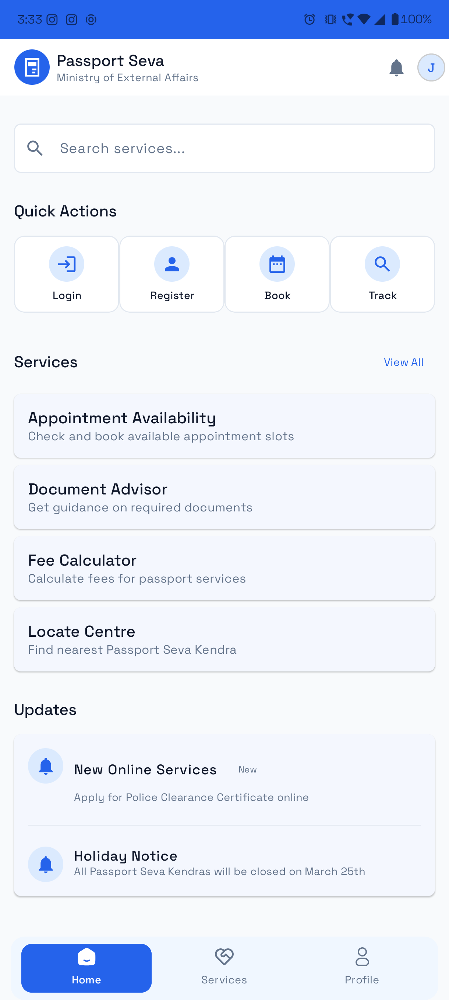
  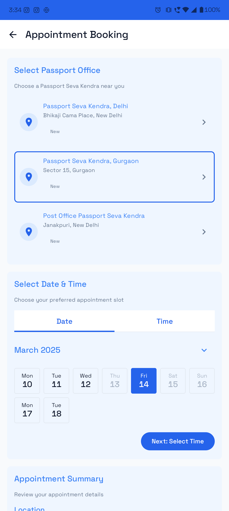
  
  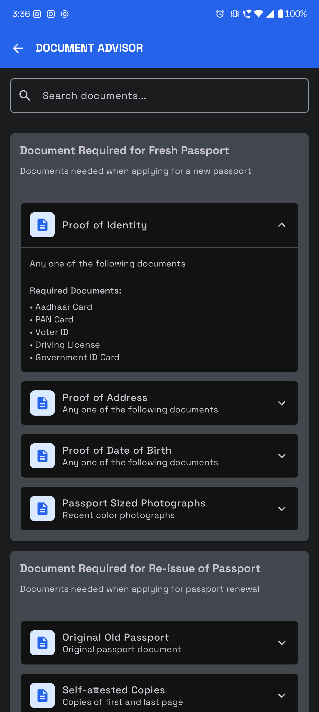
</div>

## ✨ Key Features

### 🔐 User Authentication
- Login and registration with email/password
- Social login options (Google and DigiLocker)
- Secure password management with recovery options

<div align="center">
  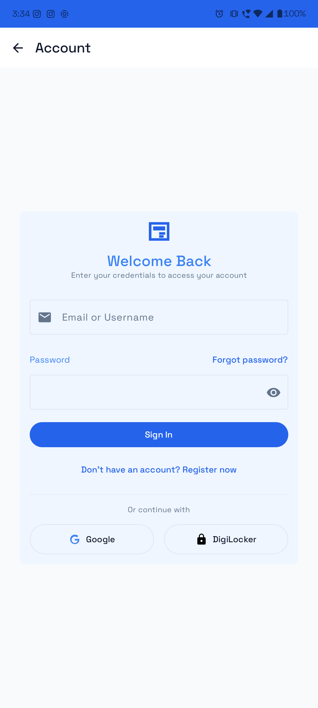
  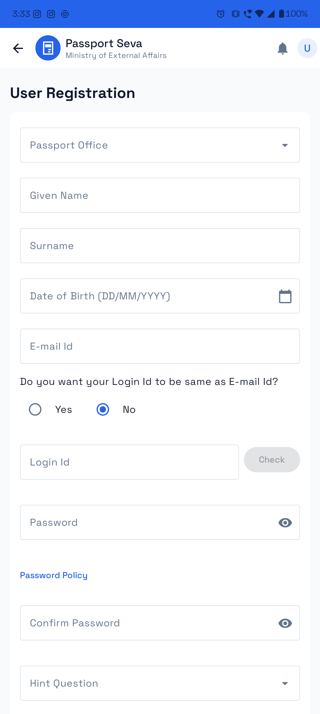
</div>

### 📅 Appointment Management
- Check appointment availability across various Passport Seva Kendras
- Book appointments for different passport services
- View and manage existing appointments
- Location-based PSK recommendations

<div align="center">
  
  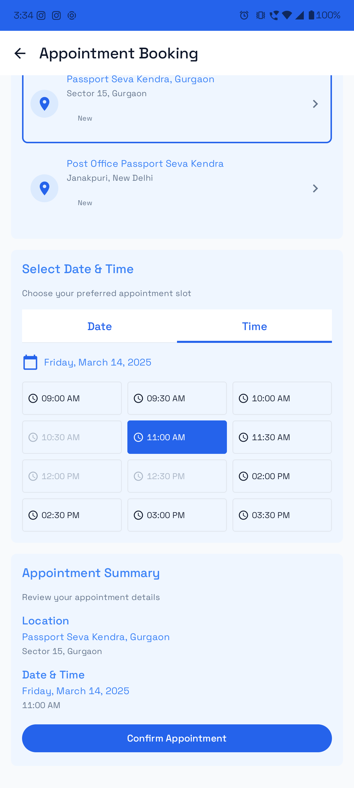
  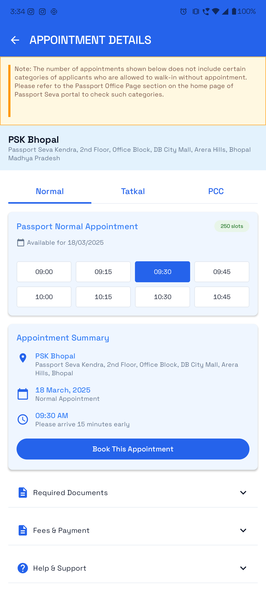
</div>

### 📑 Document Advisor
- Comprehensive document requirements guide for different passport services
- Detailed information about required document formats and specifications
- Interactive checklist for document preparation

<div align="center">
  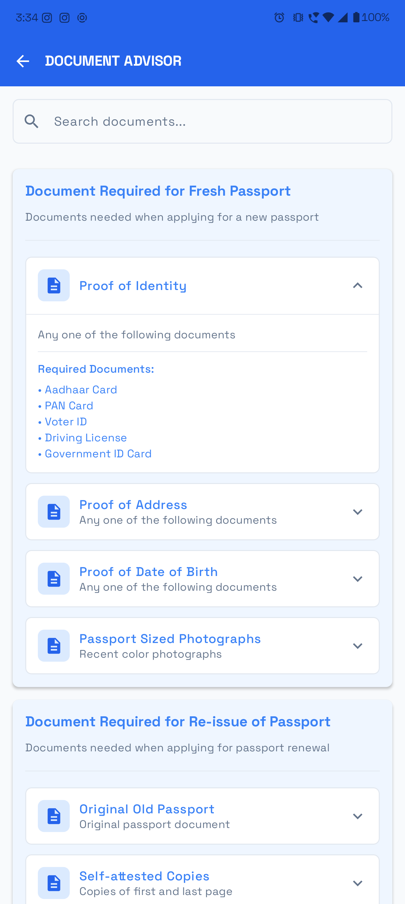
</div>

### 📋 Annexures & Forms
- Access to annexures and affidavits required for passport applications
- Downloadable PDF forms
- Organized categories for easy navigation

<div align="center">
  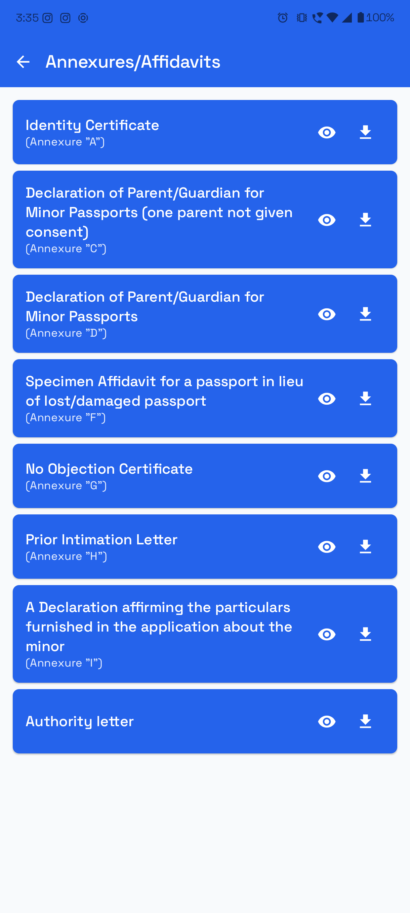
</div>

### 💰 Fee Calculator
- Calculate fees for different passport services
- Support for various passport types (normal, tatkal)
- Age-based fee calculation
- Additional services fee estimation

<div align="center">
  
</div>

### ❓ FAQs & Help
- Detailed FAQs organized by categories
- Searchable content
- Interactive Q&A format

<div align="center">
  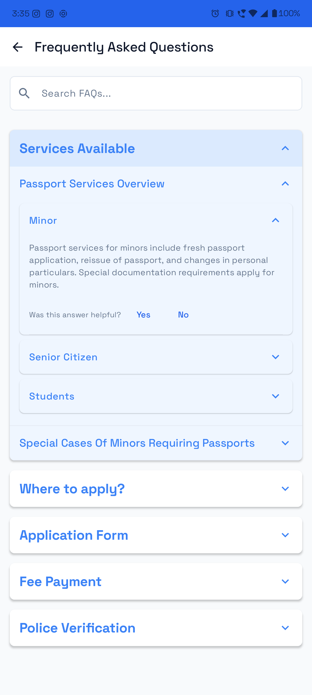
</div>

### 👤 Profile Management
- User profile management
- Personal information updates
- Security settings
- Notification preferences

<div align="center">
  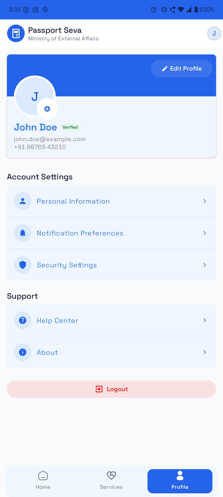
  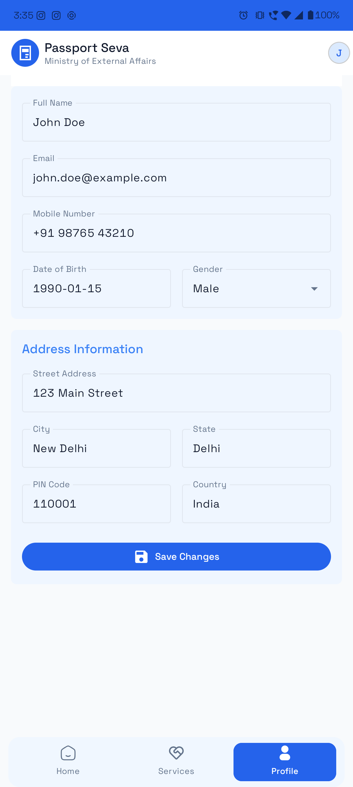
</div>

### 🌓 Theme Support
- Light and dark theme support
- Consistent design language across themes
- Material You design principles

<div align="center">
  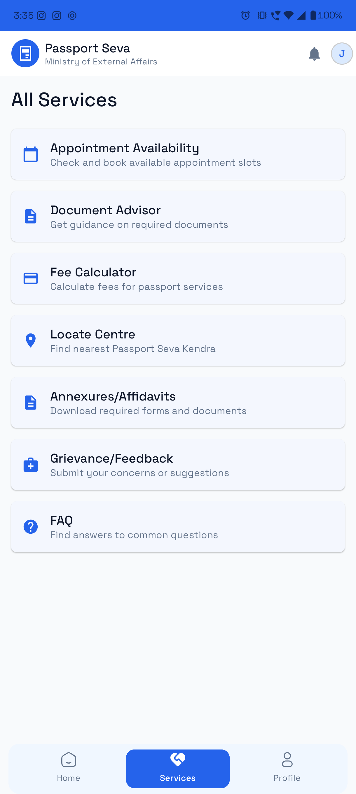
  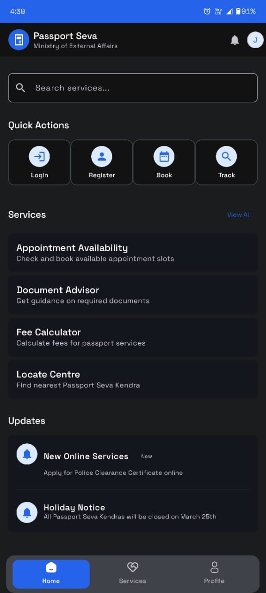
</div>

## 🏗️ Technical Architecture

The application follows Clean Architecture principles with a modular approach:

### 🧩 Layers
1. **Presentation Layer**
   - UI components built with Jetpack Compose
   - ViewModels for UI state management
   - Screen-specific components and navigation

2. **Domain Layer**
   - Business logic encapsulation
   - Use cases for specific application features
   - Repository interfaces
   - Domain models

3. **Data Layer**
   - Repository implementations
   - Local and remote data sources
   - Data transfer objects
   - Data mapping and transformation

### 🛠️ Key Technologies

- **Kotlin** - Primary programming language
- **Jetpack Compose** - Modern declarative UI toolkit
- **Material 3** - Latest Material Design components
- **MVVM Architecture** - Clear separation of concerns
- **Coroutines & Flow** - Asynchronous programming
- **Dagger Hilt** - Dependency injection
- **Navigation Component** - In-app navigation
- **Room Database** - Local data persistence 
- **Retrofit** - API communication

## 📂 Project Structure

```
com.harshsinghio.passportseva/
├── data/
│   ├── di/
│   ├── repository/
│   └── source/
│       ├── local/
│       │   ├── dao/
│       │   └── preferences/
│       └── remote/
│           ├── api/
│           └── dto/
├── domain/
│   ├── di/
│   ├── model/
│   ├── repository/
│   └── usecase/
│       ├── annexure/
│       ├── appointment/
│       ├── auth/
│       ├── services/
│       └── status/
└── presentation/
    ├── common/
    │   ├── components/
    │   ├── theme/
    │   └── util/
    ├── di/
    ├── navigation/
    └── screens/
        ├── annexures/
        ├── appointment/
        ├── appointmentdetails/
        ├── documentadvisor/
        ├── faq/
        ├── feecalculator/
        ├── home/
        ├── login/
        ├── profile/
        ├── register/
        ├── services/
        └── status/
```

## 🎨 UI Components & Design System

The application features a modern, Material 3-based design with:

- **Consistent color scheme** with primary blue accents
- **Clean, accessible typography**
- **Responsive layouts** for different screen sizes
- **Intuitive navigation** with bottom navigation bar
- **Card-based UI components** for structured information display
- **Custom components** for specialized functionality

## 💡 Key Implementation Features

### Composable UI Components
Built reusable UI components like:
- Custom AppBar
- SearchBar
- LoadingIndicator
- QuickActionItem 
- ServiceItem
- ExpandableSection

### State Management
- Used ViewModel with StateFlow for UI state management
- Implemented unidirectional data flow
- Proper separation of UI and business logic

### Navigation
- Implemented type-safe navigation with Jetpack Navigation Component
- Screen transitions and deep linking support

### Form Handling
- Built robust form validation
- User-friendly error messages
- Interactive date and time pickers

### Animations
- Smooth transitions between screens
- Micro-interactions for better user experience
- Animated content changes

## 🚀 Getting Started

### Prerequisites
- Android Studio Arctic Fox (2021.3.1) or newer
- Minimum SDK: API 21 (Android 5.0)
- Target SDK: API 33 (Android 13)
- JDK 11

### Setup Instructions
1. Clone the repository
2. Open the project in Android Studio
3. Sync Gradle files
4. Run the application on an emulator or physical device

## 📝 Development Notes

### Build Variants
- Debug: For development and testing
- Release: For production deployment

### Testing
The project supports different types of tests:
- Unit tests for domain and data layers
- UI tests with Compose testing framework
- Integration tests for end-to-end functionality

## 📊 Current Status

This application is in development phase with mockup data implemented for UI demonstration. API integration will be implemented in future updates to connect with real Passport Seva services.

## 🙏 Acknowledgments
- Material Design for UI components and guidelines
- Ministry of External Affairs documentation for passport service references
